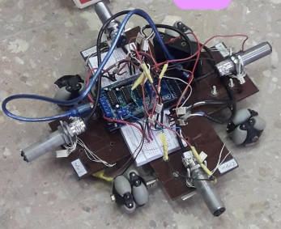
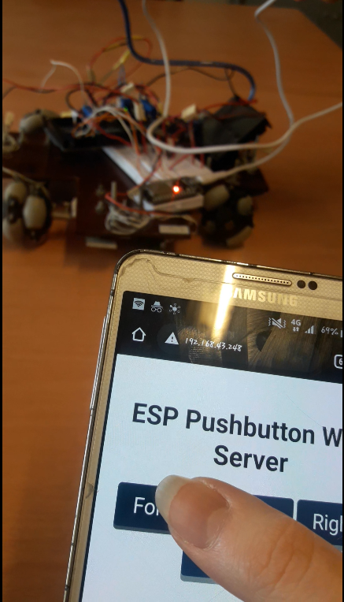

# Obstacle-avoiding-robot
The project has two phases. In first phase robot uses IR sensors to find its way between obstacles.
In second phase, ESP32 is added to help the robot move in difficult conditions using remote control. In this phase robot communicates a webpage using WiFi and user controls the robot from that page.

# Components Required
4 x IR sensor

4 x DC motor 

4 x Omni wheel

1 x Arduino mega

1 x L293 motor driver

1 x ESP32 Devkit

1 x 9v battery
# Project team
[@zamanighazaleh](https://github.com/zamanighazaleh)

[@MaryKar](https://github.com/MaryKar)
